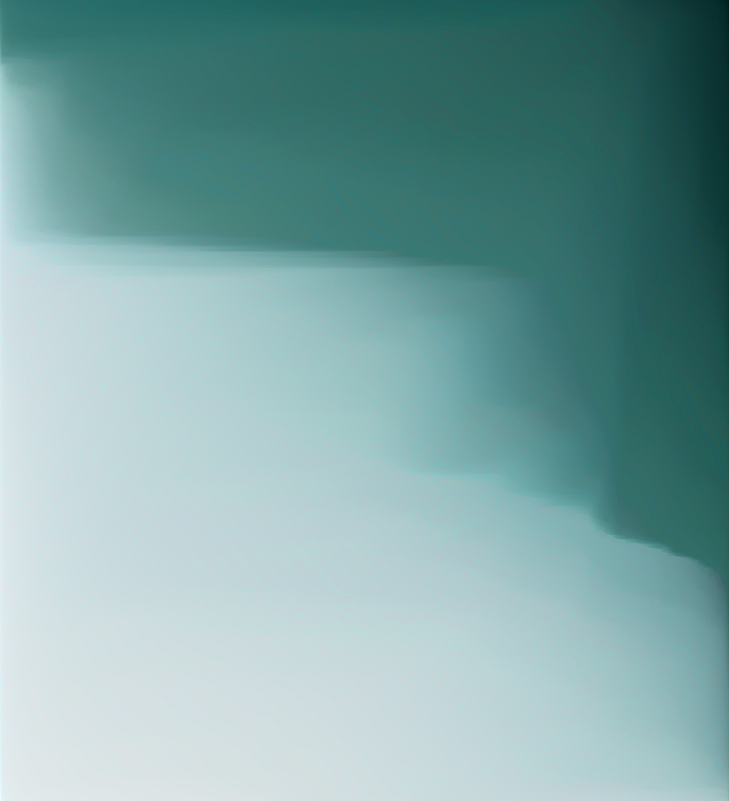

# pixel-sort

[](http://opensource.org/licenses/MIT)
[](https://david-dm.org/schulke-214/pixel-sort)
[](https://www.npmjs.com/package/pixel-sort/)

[pixel-sort](https://www.npmjs.com/package/pixel-sort/) is a library for creating pixel art with node.js.

Offering you so much flexibility with a damn easy API.

## Examples

These are a few images sorted with [pixel-sort](https://www.npmjs.com/package/pixel-sort/).

## Table of contents

-   [Installation](#installation)
-   [API Documentation](#api-documentation)
-   [License](#license)
-   [License](#license)

pixel-sort also offers (stuff)

## Installation

First install the package as dependencie
`npm install pixel-sort`

## API Documentation

`pixel-sort` has only one named export, the `Sorter` class. Its responsible for loading all the pixels of a image, sort them and finally save the resulting image. This example shows how simple the usage of the module can be. You can break this down into 3 simple steps: load, manipulate and save.

#### raw.png


```js
const { Sorter } = require('pixel-sort');
const sorter = new Sorter();

sorter.load('./raw.png', err => {
	if (err) throw err;
	// image is now loaded up into the sorter
	sorter.lightsort({ direction: 'LTR' }, err => {
		if (err) throw err;
		// image was sorted with this filter
		sorter.save('./sorted.png', err => {
			if (err) throw err;
			// image was saved to the file system
		});
	});
});
```

#### sorted.png



<!--
##### Constructor

##### Load

##### Save

##### Lightsort

##### Colorsort

-->

## License

pixel-sort is licensed under the [MIT License](https://github.com/schulke-214/pixel-sort/blob/master/LICENSE).

[back to top](#pixel-sort)
