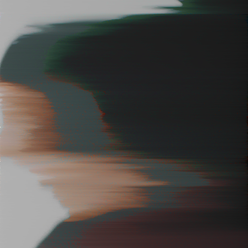

# pixel-sort

[](http://opensource.org/licenses/MIT)
[](https://david-dm.org/schulke-214/pixel-sort)
[](https://www.npmjs.com/package/pixel-sort/)

[pixel-sort](https://www.npmjs.com/package/pixel-sort/) is a library for creating pixel art with node.js.

## Table of contents

-   [Installation](#installation)
-   [Examples](#examples)
-   [API Documentation](#api-documentation)
-   [License](#license)

## Installation

```bash
yarn add pixel-sort
```

## Examples

#### Input


```js
const { Sorter } = require('pixel-sort');
const sorter = new Sorter();

(async () => {
	// load an image
	await sorter.load('./input.png');

	// apply some filters
	await sorter.lightsort({
		direction: 'LTR'
	});

	// save the image
	await sorter.save('./output.png');
})();
```

#### Output



<!--
## API Documentation

`pixel-sort` has only one named export, the `Sorter` class. Its responsible for loading all the pixels of a image, sort them and finally save the resulting image. This example shows how simple the usage of the module can be. You can break this down into 3 simple steps: load, manipulate and save.


##### Constructor

##### Load

##### Save

##### Lightsort

##### Colorsort

-->

## License

pixel-sort is licensed under the [MIT License](https://github.com/schulke-214/pixel-sort/blob/master/LICENSE).

[back to top](#pixel-sort)

---

<a href="https://www.browserstack.com/">  </a>

Thanks to [BrowserStack](https://www.browserstack.com/) for supporting the development of this project with awesome testing tools to make this project hopefully run in browser environments soon aswell!
